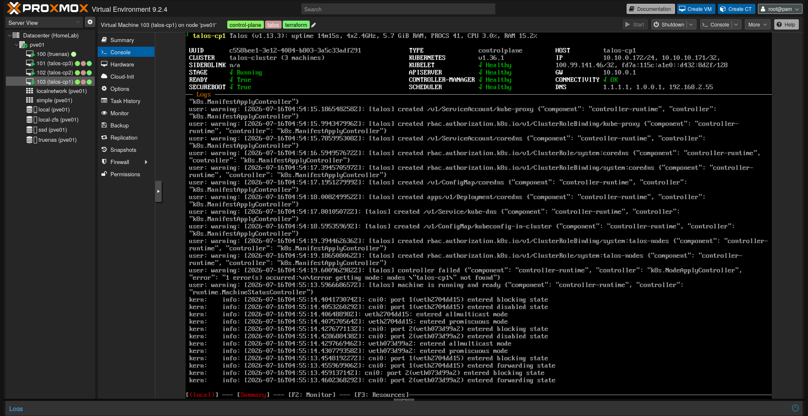
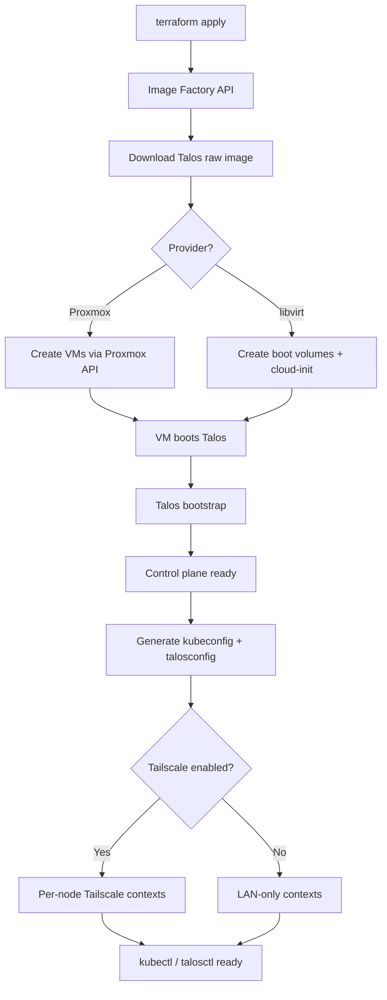

# infra-talos-homelab


Terraform modules that provision a Talos Linux Kubernetes cluster on **Proxmox VE** (via `bpg/proxmox`) or **libvirt** (via `dmacvicar/libvirt`). One `terraform apply` goes from bare hypervisor or host to a working cluster with Tailscale mesh networking.



## Architecture

### Proxmox provider

```
Proxmox VE
├── N × control plane nodes  (L2 VIP shared, Tailscale in prod)
└── M × worker nodes         (Tailscale in prod)

Terraform (proxmox/)
├── Per-env backend          (environments/{dev,prod}/terraform.tfstate)
├── Per-env tfvars           (environments/{dev,prod}/terraform.tfvars)
├── Image download           (proxmox_download_file from Image Factory)
├── VMs                      (proxmox_virtual_environment_vm per node)
└── modules/talos-cluster/
    ├── Bootstrap
    └── Kubeconfig           (LAN + Tailscale contexts)
```

### Libvirt provider

```
Libvirt (qemu:///system)
├── talos-cp1         (control plane, L2 VIP 10.0.1.10)
├── talos-w1          (worker)
├── talos-w2          (worker)
└── talos-w3          (worker)

Terraform (libvirt/)
├── NAT network       (10.0.1.0/24, DHCP from node MACs)
├── Image cache       (nocloud raw image from Image Factory)
├── Boot volumes      (one raw volume per node)
├── Cloud-init        (static IPs, Talos machine config as user-data)
└── modules/talos-cluster/
    ├── Bootstrap
    └── Kubeconfig     (LAN + Tailscale contexts)
```

## Structure

```
.github/
└── workflows/
    └── deploy.yaml                 # CI/CD: automated Terraform apply

proxmox/                        # Proxmox VE root module
├── provider.tf                  # bpg/proxmox v0.109.0
├── main.tf                      # Image download, VMs, talos module call
├── variables.tf                 # Proxmox + pass-through vars
├── outputs.tf                   # talosconfig, kubeconfig, kubeconfig_tailscale
└── environments/
    ├── dev/
    │   ├── terraform.tfvars      # Dev node definitions (3 cp, optional workers)
    │   └── terraform.tfstate     # Per-env local backend state
    └── prod/
        └── terraform.tfvars      # Prod node definitions (3 cp, optional workers)

libvirt/                        # Libvirt root module
├── provider.tf                  # dmacvicar/libvirt ~> 0.9.8 + siderolabs/talos ~> 0.11
├── main.tf                      # NAT network, boot volumes, cloud-init, VMs, talos-cluster
├── variables.tf                 # Node definitions, network, schematic, pass-through vars
├── outputs.tf                   # talosconfig, kubeconfig, kubeconfig_tailscale
└── terraform.tfvars             # Node IPs, MACs, specs

modules/
└── talos-cluster/               # Provider-agnostic child module
    ├── main.tf                  # Talos resources (bootstrap, kubeconfig)
    ├── variables.tf
    └── outputs.tf

schematic-dev.yaml               # Dev Image Factory extensions
schematic-prod.yaml              # Prod Image Factory extensions
LICENSE                          # MIT License
secrets/                         # Generated credentials (.gitignored)
├── dev/                         # talosconfig.yaml, kubeconfig.yaml
└── prod/                        # talosconfig.yaml, kubeconfig.yaml
```

## Highlights

- **Two providers** — choose Proxmox VE (`bpg/proxmox`) or libvirt (`dmacvicar/libvirt`); both share the same provider-agnostic `talos-cluster` module
- **Modular design** — infrastructure (VMs) and configuration (Talos/K8s) are separated; `talos-cluster` module works with any provider
- **Control plane** — 1–3 nodes with L2 VIP; HA with 3+ nodes. Proxmox prod runs 3 CP nodes, dev runs 1
- **Dedicated workers** — worker VMs keep workloads off the control plane; disk sizes configurable per node (20 GB CP default, 100 GB worker default)
- **Tailscale integration** — optional MagicDNS for multi-network access with per-node kubeconfig contexts
- **Longhorn-ready** — kubelet extraMounts for `/var/lib/longhorn` injected by default on all nodes; system extensions (`iscsi-tools`, `util-linux-tools`) bundled in the Image Factory schematic
- **Image caching (libvirt)** — nocloud raw images are downloaded, cached, and reused across applies; only the first apply downloads
- **NAT networking (libvirt)** — dedicated `virbr-talos` bridge with DHCP reservations and DNS entries from node MACs
- **Custom Talos image** — Image Factory schematic bundles `iscsi-tools`, `qemu-guest-agent`, `tailscale`, `util-linux-tools`

## Requirements

- **Proxmox path**: Proxmox VE 8.x with API access
- **Libvirt path**: Linux host with libvirt + KVM and `qemu:///system` accessible
- Terraform >= 1.5
- Talos Image Factory schematic ID

## How it works



**Proxmox path**: Terraform talks to the Proxmox API to download the Talos image and create VMs with cloud-init. Talos boots, the cluster bootstraps, and kubeconfig is generated with both LAN (VIP) and Tailscale contexts.

**Libvirt path**: Terraform downloads the nocloud raw image, creates boot volumes, and injects cloud-init with static IPs and Talos machine config. VMs boot via libvirt, the cluster bootstraps, and kubeconfig is generated.

Both paths share the same `talos-cluster` module for bootstrap and kubeconfig generation.

## Quick start

### Proxmox

```bash
# (Optional) enable Tailscale for prod
export TF_VAR_tailscale_auth_key="tskey-auth-..."

# Bootstrap the prod cluster (default env)
just tf-apply

# Or target the dev environment
just tf_env=dev tf-apply

# Extract credentials and merge into local config
just setup-cli             # prod
just tf_env=dev setup-cli  # dev
```

All `just` commands run from the repo root. Each environment has its own `terraform.tfvars`, backend state, and secrets directory under `proxmox/environments/`. Tailscale is only enabled for `prod`.

### Libvirt

```bash
# (Optional) enable Tailscale
export TF_VAR_tailscale_auth_key="tskey-auth-..."

# Bootstrap the cluster
just tf-libvirt-apply

# Extract credentials and merge into local ~/.talos/config and ~/.kube/config
just setup-libvirt-cli
```

## Variables

### Proxmox

| Variable | Description | Default |
|----------|-------------|---------|
| `env_name` | Environment name (`dev` / `prod`); selects schematic file, enables Tailscale on prod | — |
| `endpoint` | Proxmox API URL (e.g. `https://10.10.10.1:8006`) | — |
| `api_token` | Proxmox API token in format `user@realm!tokenid=secret` | — |
| `username` | Proxmox API user — legacy, commented out in code | — |
| `password` | Proxmox API password — legacy, commented out in code | — |
| `ssh_username` | SSH user for Proxmox node operations | `root` |
| `ssh_node_address` | SSH address for the Proxmox node (e.g. Tailscale hostname) | — |
| `insecure` | Skip TLS verification | `false` |
| `node_name` | Proxmox node for image download | — |
| `gateway` | VM default gateway | — |
| `network_bridge` | Proxmox network bridge (e.g. `vmbr0`, `vnet1`) | `vmbr0` |
| `datastore_iso` | Datastore for ISO/raw images | `local` |
| `datastore_vm` | Datastore for VM disks | `local-lvm` |
| `cluster_vip` | Virtual IP for the Kubernetes API endpoint | — |
| `nodes_cp` | Control plane nodes (hostname, ip, cores, memory, proxmox_node) | — |
| `nodes_worker` | Worker nodes (hostname, ip, cores, memory, proxmox_node) | — |
| `disk_size_cp` | Disk size in GB for control plane nodes | `20` |
| `disk_size_worker` | Disk size in GB for worker nodes | `100` |
| `tailscale_domain` | Tailscale MagicDNS domain | `lonk-mirfak.ts.net` |
| `allow_scheduling_on_control_planes` | Allow workloads on control plane nodes | `false` |

### Libvirt

| Variable | Description | Default |
|----------|-------------|---------|
| `nodes_cp` | Control plane nodes (hostname, ip, mac, cores, memory, disk_size) | — |
| `nodes_worker` | Worker nodes (hostname, ip, mac, cores, memory, disk_size) | — |
| `gateway` | Default gateway IPv4 | `10.0.1.1` |
| `network_prefix` | CIDR prefix length | `24` |
| `schematic_name` | Schematic YAML filename | `schematic-dev.yaml` |
| `talos_image_cache_dir` | Local cache for nocloud raw images | `/tmp/talos-images` |
| `cluster_name` | Talos / Kubernetes cluster name | `talos-cluster` |
| `cluster_vip` | Virtual IP for the Kubernetes API endpoint | — |
| `talos_version` | Talos Linux version | `1.13.3` |
| `kubernetes_version` | Kubernetes version | `1.36.1` |
| `tailscale_auth_key` | Tailscale auth key (empty = skip) | `""` |
| `tailscale_domain` | Tailscale MagicDNS domain | — |
| `allow_scheduling_on_control_planes` | Allow workloads on control plane nodes | `false` |
| `longhorn_enabled` | Inject kubelet extraMounts for Longhorn | `true` |
| `extra_config_patches` | Additional Talos machine config patches | `[]` |

### Shared

| Variable | Providers | Description | Default |
|----------|-----------|-------------|---------|
| `talos_version` | both | Talos Linux version | `1.13.3` |
| `cluster_vip` | both | Virtual IP for the Kubernetes API endpoint | — |
| `tailscale_auth_key` | both | Tailscale auth key (empty = skip) | `""` (opt-in) |
| `allow_scheduling_on_control_planes` | both | Allow workloads on control plane nodes | `false` |

> **Note**: Proxmox doesn't expose `cluster_name`, `kubernetes_version`, `longhorn_enabled`, or `extra_config_patches` — the `talos-cluster` module uses its defaults. Libvirt passes all of them explicitly.

## Outputs

| Output | Providers | Description |
|--------|-----------|-------------|
| `talosconfig` | both | Talos client configuration for talosctl |
| `kubeconfig` | both | Standard kubeconfig for kubectl |
| `kubeconfig_tailscale` | both | Kubeconfig with one context per Tailscale hostname |
| `machine_configuration_cp` | module | Talos machine config for control plane nodes (used by libvirt cloud-init) |
| `machine_configuration_worker` | module | Talos machine config for worker nodes (used by libvirt cloud-init) |

## Access

Use dev instead of prod on dev environments.

### Proxmox

```bash
# Use the right env
export TF_ENV=prod

# LAN (L2 VIP, check your environment's cluster_vip)
talosctl --talosconfig secrets/$TF_ENV/talosconfig.yaml version

# Tailscale (per-node contexts, prod only)
kubectl --kubeconfig secrets/$TF_ENV/kubeconfig.yaml get nodes
kubectl --kubeconfig secrets/$TF_ENV/kubeconfig.yaml config use-context talos-cp1
```

### Libvirt

```bash
# LAN (L2 VIP)
talosctl --talosconfig secrets/libvirt/talosconfig.yaml version

# Tailscale (per-node contexts)
kubectl --kubeconfig secrets/libvirt/kubeconfig.yaml get nodes
kubectl --kubeconfig secrets/libvirt/kubeconfig.yaml config use-context talos-cp1
```

## Why

Hands-on infrastructure-as-code with real hardware. Two providers let you choose your hypervisor — Proxmox VE for production-class clusters or libvirt for lightweight local development — while sharing the same modular, reproducible Talos cluster module.

## Available `just` tasks

### Proxmox

Every task accepts `tf_env=dev` to target the dev environment (default: `prod`). Each environment has its own backend state, `.tfvars`, and secrets directory.

| Task | Description |
|------|-------------|
| `tf-init` | Initialize Terraform with local backend |
| `tf-plan` | Plan changes for `tf_env` |
| `tf-apply` | Apply changes (bootstrap or update) |
| `tf-ci-apply` | Non-interactive apply for CI (`-auto-approve`) |
| `tf-destroy` | Tear down the entire environment |
| `gen-secrets` | Extract talosconfig + kubeconfig from state |
| `setup-cli` | gen-secrets + merge into `~/.talos/config` and `~/.kube/config` |
| `status` | Show Talos version, extensions, and cluster members |
| `get-schematic-id env="prod"` | Compute schematic ID from `schematic-{env}.yaml` via Image Factory API |
| `cluster-schematic-id` | Read the active schematic ID from the running cluster |

### Libvirt

| Task | Description |
|------|-------------|
| `tf-libvirt-init` | Initialize libvirt Terraform |
| `tf-libvirt-plan` | Plan libvirt changes |
| `tf-libvirt-apply` | Apply libvirt changes (bootstrap or update) |
| `tf-libvirt-destroy` | Tear down the libvirt environment |
| `gen-libvirt-secrets` | Extract talosconfig + kubeconfig from libvirt state |
| `setup-libvirt-cli` | gen-libvirt-secrets + merge into local `~/.talos/config` and `~/.kube/config` |

## CI/CD

This repo includes a GitHub Actions workflow (`.github/workflows/deploy.yaml`) for automated deployment.

To use it from a fork:

1. Configure your Proxmox endpoint and credentials in your environment's `terraform.tfvars`
2. Create ACL
```bash
	"tagOwners": {
        ...
		"tag:terraform":        ["autogroup:admin"],
		"tag:pve":              ["autogroup:admin"],
	},
    "acls": [
        // Terraform need access to 8006
		{"action": "accept", "src": ["tag:terraform"], "dst": ["tag:pve:*"]},
	],
    "ssh": [
		// Terraform need access using ssh, use ssh from tailscale (https://tailscale.com/kb/1193/tailscale-ssh/)
		{
			"action": "accept",
			"src":    ["tag:terraform"],
			"dst":    ["tag:pve"],
			"users":  ["root"],
		},
	],
```
3. Create a **Tailscale OAuth client** in the admin console with `tag:terraform` ( Add OAuth client → scopes: devices:core:write + auth_keys:write → tags: tag:terraform → copy Client ID + Secret)
4. Add these **GitHub secrets**:

| Secret | Value |
|--------|-------|
| `TS_OAUTH_CLIENT_ID` | Tailscale OAuth client ID |
| `TS_OAUTH_SECRET` | Tailscale OAuth client secret |
| `PROXMOX_API_TOKEN` | Proxmox API token |
| `TAILSCALE_AUTH_KEY` | Tailscale auth key — **reusable + ephemeral** (see below) |

5. Push to `main` — the workflow validates, applies, and uploads `talosconfig` + `kubeconfig` as artifacts

> **About `TAILSCALE_AUTH_KEY`**: Create it in the Tailscale admin console under **Settings → Keys → Auth keys**. Enable **Reusable** (same key across workflow runs) and **Ephemeral** (nodes auto-remove from tailnet when they shut down — prevents stale devices piling up). An ephemeral key won't leave orphaned machines if a VM is destroyed without properly disconnecting Tailscale.

---

## Related Projects

| Repo | Role |
|------|------|
| [`infra-talos-homelab`](https://github.com/Seom88/infra-talos-homelab) *(this repo)* | Cluster provisioning — Terraform + Talos, machine config patches, system extensions |
| [`secured-gitops-tailscale-homelab`](https://github.com/Seom88/secured-gitops-tailscale-homelab) | GitOps layer — ArgoCD, Vault, Tailscale, storage, platform apps |
