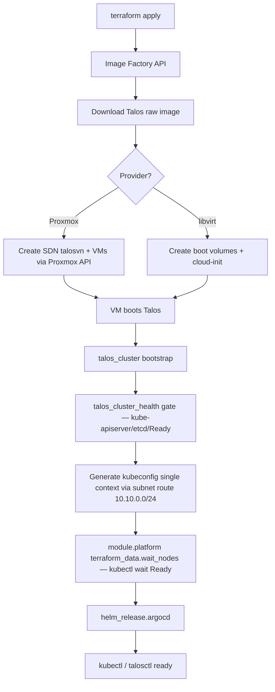

# infra-talos-homelab


Terraform modules that provision a Talos Linux Kubernetes cluster on **Proxmox VE** (via `bpg/proxmox`) or **libvirt** (via `dmacvicar/libvirt`). One `terraform apply` goes from bare hypervisor or host to a working cluster with direct per-node API endpoints (health-gated) and Tailscale subnet routing for reachability.


## Architecture

### Proxmox provider

```
Proxmox VE (SDN talosvn — VNet 10.10.0.0/24, SNAT)
├── N × control plane nodes  (direct IP, health-gated, optional allow_scheduling)
└── M × worker nodes

Terraform (environments/proxmox/<env>/)
├── Backend                  (dev: local, prod: s3 RustFS terraform-homelab)
├── SDN network              (proxmox_sdn_zone + VNet talosvn + subnet + applier, modules/proxmox/network.tf)
├── Image download           (proxmox_download_file bootstrap-only, modules/proxmox/main.tf)
├── VMs                      (proxmox_virtual_environment_vm per node)
└── modules/talos-cluster/
    ├── Bootstrap (talos_cluster, health gate talos_cluster_health)
    └── Kubeconfig (single context via subnet route 10.10.0.0/24)
```

### Libvirt provider

```
Libvirt (qemu:///system)
├── talos-cp1         (control plane)
├── talos-w1          (worker)
├── talos-w2          (worker)
└── talos-w3          (worker)

Terraform (environments/libvirt/<env>/)
├── NAT network       (virbr-talos, 10.0.1.0/24 DHCP from node MACs, modules/libvirt/network.tf)
├── Image cache       (nocloud raw image, persistent ~/.cache/talos-images, modules/libvirt/image.tf)
├── Storage pool      (talos-pool at /var/lib/libvirt/images/talos, modules/libvirt/pool.tf)
├── Boot volumes + domains (modules/libvirt/vms.tf, deterministic MAC via md5 when omitted)
└── modules/talos-cluster/
    ├── Bootstrap (talos_cluster) + health gate (talos_cluster_health)
    └── Kubeconfig (single context via subnet route)
```

## Structure

```
.
├── .github/workflows/
│   ├── deploy.yaml                 # CI: validate + single terraform apply per env (S3 state for prod)
│   └── destroy.yaml                # CI: terraform destroy (S3 state for prod, RustFS)
├── docs/
│   ├── adr/                        # Architecture Decision Records (MADR: 001, 002, ...)
│   └── demo.png
├── environments/                   # Composed roots — one state per env (infra + platform)
│   ├── proxmox/
│   │   ├── dev/                    # backend local — bpg/proxmox 0.111.1, helm ~>2.17, talos 0.12.0-alpha.5
│   │   └── prod/                   # backend s3 (RustFS bucket terraform-homelab, key proxmox/prod/terraform.tfstate)
│   └── libvirt/
│       ├── dev/                    # backend local — dmacvicar/libvirt ~>0.9.8, talos 0.12.0-alpha.5
│       └── prod/                   # backend s3 (RustFS bucket terraform-homelab, key libvirt/prod/terraform.tfstate)
│       # each env: main.tf, provider.tf, variables.tf, outputs.tf, terraform.tfvars
├── modules/
│   ├── talos-cluster/              # Provider-agnostic: bootstrap (talos_cluster), kubeconfig, machine configs
│   ├── proxmox/                    # Proxmox VE: SDN talosvn (network.tf), VMs (main.tf), talos-cluster call
│   ├── libvirt/                    # Libvirt: network.tf, image.tf, pool.tf, vms.tf, cluster.tf (health gate)
│   └── platform/                   # Composable ArgoCD (helm_release) — called from each environment root
├── schematic-dev.yaml / schematic-prod.yaml  # Image Factory system extensions (iscsi-tools, qemu-guest-agent, util-linux-tools)
├── renovate.json                   # Renovate bot: weekly Terraform + talos_version/argocd_version updates (manual-review)
├── secrets/<provider>/<env>/       # Generated talosconfig.yaml, kubeconfig.yaml (.gitignored, per env)
├── justfile                        # Unified tasks: just provider=<proxmox|libvirt> env=<prod|dev> tf-apply / tf-apply-upgrade / tf-destroy ...
└── LICENSE, README.md, CHANGELOG.md, CONTRIBUTING.md
```

> All 4 envs now ship input validations (semver for `talos_version`/`kubernetes_version`/`argocd_version`, CIDR for `network_cidr`, IP for `gateway`/`cp_ips`, non-empty `cluster_name`/`env_name` + `^(dev|prod)$` — 57 blocks total) and a parameterized `drain_on_upgrade` (bool, default `false`, platform-aware; `false` for Longhorn prod).

## Highlights

- **Two providers** — choose Proxmox VE (`bpg/proxmox`) or libvirt (`dmacvicar/libvirt`); both share the same provider-agnostic `talos-cluster` module
- **Modular design** — infrastructure (VMs) and configuration (Talos/K8s) are separated; `talos-cluster` module works with any provider
- **Control plane** — 1–3 nodes with direct per-node IPs health-gated via `talos_cluster_health`. HA with 3+ nodes. Proxmox prod runs 3 CP nodes, dev runs 1
- **Dedicated workers** — worker VMs keep workloads off the control plane; disk sizes and datastores configurable per node (20 GB CP default, 100 GB worker default, `disk_size` + `datastore`/`pool` required per node)
- **Per-node scheduling** — `nodes_cp[].allow_scheduling` controls `cluster.allowSchedulingOnControlPlanes` per control-plane node (replaces the old global flag)
- **Tailscale subnet routing only** — Tailscale Talos extension disabled (see ADR 001). Cluster reachability for `10.10.0.0/24` is via a Tailscale subnet router (`tailscale set --advertise-routes=10.10.0.0/24` on the Proxmox host, `tailscale/github-action` in CI). No per-node Tailscale kubeconfigs — single context via subnet route
- **Longhorn-ready** — kubelet extraMounts for `/var/lib/longhorn` injected by default on all nodes; system extensions (`iscsi-tools`, `util-linux-tools`) bundled in the Image Factory schematic
- **Image caching (libvirt)** — nocloud raw images are downloaded, cached, and reused across applies; only the first apply downloads
- **NAT networking (libvirt)** — dedicated `virbr-talos` bridge with DHCP reservations and DNS entries from node MACs
- **Custom Talos image** — Image Factory schematic bundles `iscsi-tools`, `qemu-guest-agent`, `util-linux-tools` (tailscale extension removed — see ADR 001, subnet routing only)
- **SDN networking (Proxmox)** — `talosvn` VNet (`proxmox_sdn_zone` + `proxmox_sdn_vnet` + `proxmox_sdn_subnet` with `snat = true`) plus `proxmox_sdn_applier` so the bridge exists before VMs boot; VMs get outbound internet via MASQUERADE
- **In-place Talos upgrades** — `talos_machine` keeps the OS version in sync via `image`; bumping `talos_version` triggers a sequential rolling upgrade (pull → install → reboot) with parameterized `drain_on_upgrade` (bool, default `false`, platform-aware — `false` for prod with Longhorn, opt-in `true` for dev) and `-parallelism=1` (`just tf-apply-upgrade`), so etcd quorum is protected without VM recreation. Installer images are platform-aware (`nocloud-installer-secureboot` by default, `nocloud-installer` override for libvirt)
- **Hardened inputs** — 57 validation blocks across `modules/talos-cluster`, `modules/proxmox`, `modules/libvirt` and all 4 envs: semver for `talos_version`/`kubernetes_version`/`argocd_version`, CIDR for `network_cidr`, IP for `gateway`/`cp_ips`, non-empty `cluster_name`/`env_name` (`^(dev|prod)$`), nullable guards for `machine_secrets`/`client_configuration`

## Requirements

- **Proxmox path**: Proxmox VE 8.x with API access
- **Network access (Proxmox SDN)**: the machine running `terraform apply` (laptop or CI) must be able to reach the cluster subnet `10.10.0.0/24`. The `talosvn` SDN VNet is isolated — VMs get outbound internet via SNAT but nothing from outside reaches them directly. For `prod`, expose the subnet through a Tailscale subnet router (see [Quick start → Proxmox](#proxmox-1))
- **Libvirt path**: Linux host with libvirt + KVM and `qemu:///system` accessible
- Terraform >= 1.11
- Talos Image Factory schematic ID

## How it works


```mermaid
flowchart TD
    A[terraform apply] --> B[Image Factory API]
    B --> C[Download Talos raw image]
    C --> D{Provider?}

    D -->|Proxmox| E[Create SDN talosvn + VMs via Proxmox API]
    D -->|libvirt| F[Create boot volumes + cloud-init]

    E --> G[VM boots Talos]
    F --> G

    G --> H[talos_cluster bootstrap]
    H --> I[talos_cluster_health gate — kube-apiserver/etcd/Ready]
    I --> J[Generate kubeconfig single context via subnet route 10.10.0.0/24]
    J --> K[module.platform terraform_data.wait_nodes — kubectl wait Ready]
    K --> L[helm_release.argocd]
    L --> M[kubectl / talosctl ready]
```

**Proxmox path**: Terraform creates the SDN stack (`proxmox_sdn_zone` + VNet `talosvn` + subnet `snat = true` + `proxmox_sdn_applier`), downloads the Talos image and creates VMs with cloud-init. Talos boots, `talos_cluster` bootstraps the first control plane node, `talos_cluster_health` blocks until kube-apiserver, etcd and all nodes are Ready (direct per-node IPs, health-gated), `local_file.kubeconfig` materializes a single-context kubeconfig via the subnet route `10.10.0.0/24`, and `module.platform` installs ArgoCD in the same apply.

**Libvirt path**: Terraform downloads the nocloud raw image, creates boot volumes, and injects cloud-init with static IPs and Talos machine config. VMs boot via libvirt, the cluster bootstraps, the health gate blocks until Ready, and the same single-context kubeconfig + platform flow runs.

Both paths share the same `talos-cluster` module for bootstrap and kubeconfig generation (`talos_machine.control_plane`/`talos_machine.worker` + `talos_cluster`, not legacy `talos_machine_configuration_apply`).

## Quick start

### Proxmox

```bash
# Bootstrap the prod cluster (default env)
just tf-apply

# Or target the dev environment
just provider=proxmox env=dev tf-apply

# Extract credentials and merge into local config
just setup-cli                         # proxmox/prod (default)
just provider=proxmox env=dev setup-cli  # proxmox/dev
```

All `just` commands run from the repo root. Each environment has its own `terraform.tfvars`, backend state at `environments/<provider>/<env>/terraform.tfstate` (single file now includes both infra and platform via `module.platform`), and secrets at `secrets/<provider>/<env>/`. Tailscale node extension is disabled (ADR 001) — reachability to `10.10.0.0/24` is via subnet routing (see below), not `TF_VAR_tailscale_auth_key`.

> **Network reachability (Proxmox SDN)**: Terraform must be able to reach the cluster IPs (`10.10.0.0/24`). The `talosvn` SDN VNet is isolated — VMs get outbound internet via SNAT (subnet `snat = true`), but traffic from outside cannot reach them directly. If you are not on the same network as the Proxmox host, expose the subnet through Tailscale from the Proxmox node (prod):
>
> ```bash
> # 1. On the Proxmox host (subnet router — it already runs Tailscale)
> sudo tailscale set --advertise-routes=10.10.0.0/24
> ```
>
> 2. Approve the route: admin console → **Machines** → the host row → **Subnets** → **Edit route settings** → tick `10.10.0.0/24` → **Save**
> 3. On the device running Terraform: `sudo tailscale set --accept-routes` (Linux only — Windows/macOS accept routes by default)
>
> Without the route, the `talos_cluster_health` gate waits until its 15 m timeout because it cannot reach the control plane endpoints (direct per-node IPs).

### Libvirt

```bash
# Bootstrap the cluster
just provider=libvirt tf-apply

# Extract credentials and merge into local ~/.talos/config and ~/.kube/config
just provider=libvirt setup-cli
```

Libvirt uses the same subnet-routing model for remote reachability; no `TF_VAR_tailscale_auth_key` is required on nodes (extension disabled).

## Variables

### Proxmox

| Variable | Description | Default |
|----------|-------------|---------|
| `env_name` | Environment name (`dev` / `prod`); selects schematic file — validated `^(dev|prod)$` | — |
| `endpoint` | Proxmox API URL (e.g. `https://10.10.10.1:8006`) | — |
| `api_token` | Proxmox API token in format `user@realm!tokenid=secret` | — |
| `username` | Proxmox API user — legacy, commented out in code | — |
| `password` | Proxmox API password — legacy, commented out in code | — |
| `ssh_username` | SSH user for Proxmox node operations | `root` |
| `ssh_node_address` | SSH address for the Proxmox node (e.g. Tailscale hostname) | — |
| `insecure` | Skip TLS verification | `false` |
| `node_name` | Proxmox node for image download | — |
| `gateway` | VM default gateway | — |
| `network_bridge` | Proxmox network bridge (must match SDN VNet id `talosvn` when using SDN) | `vmbr0` |
| `sdn_zone` | SDN zone id for the Talos network | `talos` |
| `network_cidr` | CIDR for the SDN VNet subnet (must contain node IPs) | `10.10.0.0/24` |
| `network_mtu` | MTU for the SDN zone | `1500` |
| `network_snat` | Enable SNAT on the SDN subnet (MASQUERADE for VM egress) | `true` |
| `datastore_iso` | Datastore for ISO/raw images | `local` |
| `nodes_cp` | Control plane nodes (hostname, ip, cores, memory, proxmox_node, disk_size, datastore, allow_scheduling — all required) | — |
| `nodes_worker` | Worker nodes (hostname, ip, cores, memory, proxmox_node, disk_size, datastore — all required) | — |
| `talos_version` | Talos Linux version | `1.13.9` |
| `argocd_version` | ArgoCD Helm chart version | `9.5.13` |
| `enable_health_check` | Enable `talos_cluster_health` gate (set `false` for destroy) | `true` |

> Tailscale node extension is disabled (ADR 001): node extension variables are commented out in `variables.tf` as `Tailscale extension disabled`. Subnet routing only (`10.10.0.0/24`). API uses direct per-node IPs (health-gated, removed in 2.0.0).

### Libvirt

| Variable | Description | Default |
|----------|-------------|---------|
| `nodes_cp` | Control plane nodes (hostname, ip, mac, cores, memory, disk_size, pool, allow_scheduling — all required) | — |
| `nodes_worker` | Worker nodes (hostname, ip, mac, cores, memory, disk_size, pool — all required) | — |
| `pool_name` | Dedicated storage pool name | `talos-pool` |
| `pool_path` | Filesystem path for the pool | `/var/lib/libvirt/images/talos` |
| `gateway` | Default gateway IPv4 | `10.0.1.1` |
| `network_cidr` | Subnet CIDR for the Libvirt NAT network | `10.0.1.0/24` |
| `secureboot` | Enable UEFI SecureBoot (q35) | `true` |
| `talos_image_cache_dir` | Local cache for nocloud raw images | `~/.cache/talos-images` |
| `cluster_name` | Talos / Kubernetes cluster name | `talos-cluster` |
| `talos_version` | Talos Linux version — semver validated | `1.13.9` |
| `kubernetes_version` | Kubernetes version — semver validated | `1.36.2` |
| `longhorn_enabled` | Inject kubelet extraMounts for Longhorn | `true` |
| `extra_config_patches` | Additional Talos machine config patches | `[]` |
| `env_name` | Selects schematic file (`schematic-<env_name>.yaml`) — validated `^(dev|prod)$` (`dev` in `libvirt/dev`, `prod` in `libvirt/prod` + both proxmox envs) | `dev` |
| `argocd_version` | ArgoCD Helm chart version — semver validated | `9.5.13` |
| `enable_health_check` | Enable `talos_cluster_health` gate (set `false` for destroy) | `true` |

> Tailscale node extension is disabled: extension variables commented out (see ADR 001). API uses direct per-node IPs.

### Shared

| Variable | Providers | Description | Default |
|----------|-----------|-------------|---------|
| `talos_version` | both | Talos Linux version | `1.13.9` |
| `installer_image` | module | Installer container image for `talos_machine.image` (e.g. `factory.talos.dev/nocloud-installer/<schematic-id>:v<version>`). Must match platform flavor — secureboot roots can omit (defaults to `nocloud-installer-secureboot` built from `talos_image_id` + `talos_version`); non-secureboot roots (e.g. libvirt) must override | `""` |
| `cp_allow_scheduling` | module | Per control plane node: allow workloads on that node (from `nodes_cp[].allow_scheduling`). Applied per node via the Talos `cluster.allowSchedulingOnControlPlanes` machine-config patch (Sidero docs) | — |

> **Note**: Proxmox doesn't expose `cluster_name`, `kubernetes_version`, `longhorn_enabled`, or `extra_config_patches` — the `talos-cluster` module uses its defaults. Libvirt passes all of them explicitly. Tailscale node extension and the former shared API address were removed in 2.0.0 (direct per-node IPs via health gate).

## ⚠️ Changes that destroy your cluster

Some `terraform.tfvars` values make Terraform **destroy and recreate the VMs** instead of updating them in place. A recreated control plane node loses its etcd data; if more than one node is replaced, the cluster loses quorum — the cluster comes back empty, and the platform layer is re-provisioned on the next single `terraform apply` (ArgoCD via `module.platform`, Longhorn via the GitOps repo wave-0 app).

> **Rule of thumb**: `terraform apply` provisions and updates *configuration* and now also drives **rolling Talos upgrades** via `talos_machine.image` (see [Upgrading Talos](#upgrading-talos) below). Only bootstrap image changes and destructive `tfvars` keys still force VM recreation.

### 🔴 Destroys the cluster (VM destroy + recreate)

| tfvars key | What happens |
|------------|--------------|
| `datastore_iso`, `nodes_cp[].datastore` / `nodes_worker[].datastore` | Disks recreated on the new datastore |
| `node_name`, `nodes_cp[].proxmox_node` | Proxmox doesn't migrate VMs between nodes — destroy + create |
| `nodes_cp[].disk_size` / `nodes_worker[].disk_size` (decrease) | Disks can't shrink — destroy + create |
| Removing a node from `nodes_cp` / `nodes_worker` | That VM is destroyed |
| `env_name` | Different resource namespace → full recreate |

### 🟡 Outage without data loss (rolling upgrade / reboot)

| tfvars key | What happens |
|------------|--------------|
| `talos_version` | Bumping the version triggers a **sequential rolling upgrade** via `talos_machine.image` (pull → install → reboot, one node at a time with `-parallelism=1` to protect etcd quorum). No VM recreation, no etcd wipe. `drain_on_upgrade = false`. A fresh `terraform destroy` + `apply` or manually tainting `proxmox_download_file.talos_image` still pulls a new bootstrap image |
| `schematic-{env}.yaml` (editing system extensions) | New schematic ID changes `local.installer_image` → same rolling upgrade path as `talos_version`. The bootstrap disk (`proxmox_download_file.talos_image`) ignores `url` changes (`lifecycle { ignore_changes = [url] }`), so etcd is preserved |
| `network_bridge`, `sdn_zone`, `network_cidr`, `network_mtu`, `network_snat` | SDN config re-pushed, VMs reboot |
| `gateway` | Machine config re-pushed; cluster endpoint (direct per-node IPs) changes |
| `kubernetes_version` | Machine config re-pushed (rolling kubelet update) |

> **Note**: `proxmox_download_file.talos_image` now uses a shared `file_name` (`talos-nocloud-amd64-secureboot.img`, no `env`/`version` suffix) and `lifecycle { ignore_changes = [url] }` — bumping `talos_version` or editing the schematic no longer recreates the download file/disks. Upgrades are handled by `talos_machine.image`. `justfile`'s `tf-apply` runs with `-parallelism=10` for fast bootstrap; use `tf-apply-upgrade` (`-parallelism=1`) for sequential Talos rolling upgrades.

### 🟢 Safe to change

`endpoint`, `api_token`, `ssh_username`, `ssh_node_address`, `insecure`, `nodes_cp[].allow_scheduling`.

> Tailscale node extension is disabled (ADR 001) — uncomment variables in `variables.tf` / `schematic-*.yaml` to re-enable.

### Upgrading Talos

Bumping `talos_version` and running `just tf-apply-upgrade` (or `just tf-apply -parallelism=1`) performs a sequential in-place upgrade via `talos_machine.image` (control planes first, then workers) with `-parallelism=1` to protect etcd quorum. The installer image is platform-aware: `factory.talos.dev/nocloud-installer-secureboot/...` by default (Proxmox/secureboot), overridden to `factory.talos.dev/nocloud-installer/...` for libvirt via `var.installer_image`. `drain_on_upgrade = false` (revisit when dedicated workers carry workloads). Bump the pin in `modules/proxmox/variables.tf` (default `1.13.9`), `modules/libvirt/variables.tf` (`1.13.9`) or `environments/<provider>/<env>/terraform.tfvars`, then apply.

## Outputs

| Output | Providers | Description |
|--------|-----------|-------------|
| `talosconfig` | both | Talos client configuration for talosctl |
| `kubeconfig` | both | Standard kubeconfig for kubectl (single context via subnet route `10.10.0.0/24`) |
| `machine_configuration_cp` | module | Talos machine config for control plane nodes (used by libvirt cloud-init) |
| `machine_configuration_worker` | module | Talos machine config for worker nodes (used by libvirt cloud-init) |

## Access

Use `provider` and `env` to select the cluster (defaults: `proxmox` / `prod`). API access is via direct per-node IPs (`10.10.0.0/24` via subnet route), health-gated by `talos_cluster_health`. Kubeconfig has a single context via subnet route.

### Proxmox

```bash
# Direct per-node IP (via subnet route 10.10.0.0/24)
talosctl --talosconfig secrets/proxmox/prod/talosconfig.yaml -n 10.10.0.11 version
kubectl --kubeconfig secrets/proxmox/prod/kubeconfig.yaml get nodes
```

### Libvirt

```bash
# Direct per-node IP (via NAT / subnet route)
talosctl --talosconfig secrets/libvirt/dev/talosconfig.yaml -n 10.0.1.11 version
kubectl --kubeconfig secrets/libvirt/dev/kubeconfig.yaml get nodes
```

## Why

Hands-on infrastructure-as-code with real hardware. Two providers let you choose your hypervisor — Proxmox VE for production-class clusters or libvirt for lightweight local development — while sharing the same modular, reproducible Talos cluster module.

## Available `just` tasks

All tasks run from the repo root. `provider` (`proxmox` | `libvirt`) and `env` (`prod` | `dev`) select the environment (defaults: `proxmox`/`prod`):

```bash
just tf-apply                              # proxmox/prod (default)
just provider=proxmox env=dev tf-apply     # proxmox/dev
just provider=libvirt env=dev tf-apply     # libvirt/dev
just provider=libvirt env=prod tf-apply    # libvirt/prod
```

| Task | Description |
|------|-------------|
| `tf-fmt` | Format all Terraform files recursively |
| `tf-init` | Initialize Terraform with the env backend (local for dev, S3 RustFS for prod) |
| `tf-plan` | Plan changes for the active provider/env |
| `tf-apply` | Apply changes (bootstrap or update) — runs with `-parallelism=10` (fast bootstrap, use `tf-apply-upgrade -parallelism=1` for Talos rolling upgrades) |
| `tf-apply-upgrade` | Apply with `-parallelism=1` for sequential Talos rolling upgrades (protects etcd quorum) |
| `tf-destroy` | Tear down the active provider/env (`TF_VAR_enable_health_check=false` so the health gate does not block) |
| `gen-secrets` | Extract talosconfig + kubeconfig from state |
| `setup-cli` | `gen-secrets` + merge into `~/.talos/config` and `~/.kube/config` |
| `status` | Show Talos version, extensions, and cluster members |
| `get-schematic-id name="prod"` | Compute schematic ID from `schematic-{name}.yaml` via the Image Factory API |
| `cluster-schematic-id` | Read the active schematic ID from the running cluster |

### Platform (ArgoCD) — now composed

Platform (ArgoCD) is a composable module (`modules/platform`) called from each environment root. One `terraform apply` deploys both infra and platform in one state file at `environments/<provider>/<env>/terraform.tfstate` (kubeconfig at `secrets/<provider>/<env>/kubeconfig.yaml`). The standalone `platform/` root was removed in 2.0.0 — see `CHANGELOG.md` and `modules/platform/README.md` for `terraform state mv` migration.

`tf-platform-*` tasks are kept for backward compatibility and now delegate to `tf-apply`/`tf-plan`/`tf-init` with a deprecation warning:

| Task | Description |
|------|-------------|
| `tf-platform-init` | Deprecated → delegates to `tf-init` |
| `tf-platform-plan` | Deprecated → delegates to `tf-plan` |
| `tf-platform-apply` | Deprecated → delegates to `tf-apply` |
| `tf-platform-destroy` | Deprecated → prints destroy guidance (`tf-destroy` or `terraform destroy -target=module.platform.helm_release.argocd`) |

## Platform (ArgoCD)

The **platform layer** is now a composable module (`modules/platform`) called from each environment root (`environments/<provider>/<env>`). It installs the **platform** on top of the cluster in the same state file and same `terraform apply`:

- **ArgoCD** (`argocd`) — GitOps engine (via `helm_release.argocd` in `modules/platform`).

Longhorn is no longer installed here: it is a platform app of the GitOps repo (`secured-gitops-tailscale-homelab`, `platform/longhorn`, wave 0, gated by a CSI readiness Job). The Longhorn node prerequisites still live in this repo at cluster level: kubelet extraMounts for `/var/lib/longhorn` and the `iscsi-tools` / `util-linux-tools` system extensions.

### Setup flow (composed)

1. `just provider=proxmox env=prod tf-apply` — provisions the cluster (VMs, Talos bootstrap) and then the platform (ArgoCD). The infra health gate (`talos_cluster_health`) blocks until kube-apiserver, etcd, and all nodes are Ready; `module.platform.terraform_data.wait_nodes` then waits for `Ready` nodes before the Helm release.
2. `just provider=proxmox env=prod setup-cli` — regenerates `secrets/proxmox/prod/kubeconfig.yaml` and merges it into the local CLI configs (still useful for out-of-band debugging).
3. GitOps repo bootstrap — ArgoCD syncs the applications from the GitOps repository; Longhorn is deployed as a wave-0 app (with CSI readiness gate) during this step.

Each environment configures the `helm` provider against `secrets/<provider>/<env>/kubeconfig.yaml` (see `environments/<provider>/<env>/provider.tf`). The module accepts `kubeconfig_path = abspath("${path.root}/../../../secrets/<provider>/<env>/kubeconfig.yaml")` and re-triggers the node gate when the kubeconfig hash changes.

**Destroy:** a single `just provider=proxmox env=prod tf-destroy` tears down both infra and platform (one state). To remove only the platform release: `terraform -chdir=environments/proxmox/prod destroy -target=module.platform.helm_release.argocd`.

### Migrating an existing cluster

If the cluster already has ArgoCD installed (for example, via the `init-infra.sh` script from the GitOps repo), you can adopt the existing release into the Terraform state with `terraform import`:

```bash
terraform -chdir=environments/proxmox/prod import 'module.platform.helm_release.argocd' argocd/argocd
```

For legacy `platform/` states, see `CHANGELOG.md` (2.0.0) and `modules/platform/README.md` for `terraform state mv` from the standalone root into the composed environment state.

#### Migrating Longhorn to the GitOps repo (legacy)

Longhorn is no longer managed here. If you still have a legacy `platform/` state that contains `helm_release.longhorn`:

```bash
# 1) In the secured repo: push the changes (platform/longhorn + gitops/values) and
#    wait until the longhorn ArgoCD app is Healthy (CSI gate Job completed).
# 2) Only then, in the legacy root, remove the resources from the TF state so the next
#    apply does NOT destroy them:
terraform -chdir=platform state rm helm_release.longhorn kubernetes_namespace_v1.longhorn_system kubernetes_manifest.longhorn_prod_storageclass terraform_data.csi_waiter
# 3) Apply the reduced platform layer (ArgoCD only) in the composed model:
just provider=proxmox env=prod tf-apply
# Do NOT run terraform destroy on helm_release.longhorn: it would delete the volumes.
```

### State

Platform is now composed in each environment root — single state at `environments/<provider>/<env>/terraform.tfstate` (covers both infra `module.proxmox`/`module.libvirt` and `module.platform`). Prod state is on S3 (RustFS bucket `terraform-homelab`); dev state is local (intentional, no lock — see C1). CI no longer uses `tfstate-*` artifacts.

> **Migration note:** legacy locations `platform/terraform.tfstate`, `platform/environments/prod/platform-terraform.tfstate`, `platform/environments/<env>/platform-terraform.tfstate`, and `platform/environments/<provider>/<env>/terraform.tfstate` are superseded by the composed model. Keep old files on disk for manual `terraform state mv` into `environments/<provider>/<env>/module.platform.*` (see `CHANGELOG.md` 2.0.0), but new `just tf-apply` and CI use the single environment state.

## CI/CD

This repo includes GitHub Actions workflows (`.github/workflows/deploy.yaml` + `destroy.yaml`) for automated deployment. `validate` now runs on **all 4 envs** (`proxmox/prod`, `proxmox/dev`, `libvirt/prod`, `libvirt/dev`) with `terraform init -backend=false` + `terraform validate`; platform `fmt`/`validate` stays gated to `proxmox/prod`. Prod state is S3 (RustFS `terraform-homelab`); dev stays **local by design** (no S3, no TODO — intentional).

**Renovate** (`renovate.json`) runs weekly (Monday 05:00 `Europe/Madrid`, `config:recommended`): Terraform providers are grouped into one `terraform providers` PR, `siderolabs/talos` provider stays pinned at `0.12.0-alpha.5` (ADR 002, `enabled: false` until `siderolabs/terraform-provider-talos#352` is fixed), and `talos_version` (`github-releases/siderolabs/talos`) + `argocd_version` (`helm/argo-cd` via `https://argoproj.github.io/argo-helm`) are tracked via `customManagers` regex in all `variables.tf` with `manual-review/talos` / `manual-review/argocd` labels and `automerge: false`. `kubernetes_version` is intentionally **not** managed by Renovate — it is owned by `talos_cluster.kubernetes_version` with `ignore_kubernetes_upgrade_drift = true` (see `modules/talos-cluster/main.tf:124,184`). Validate Talos upgrades in `libvirt/dev` before merging to prod.

To use it from a fork:

1. Configure your Proxmox endpoint and credentials in your environment's `terraform.tfvars`
2. Create ACL
```bash
	"tagOwners": {
        ...
		"tag:terraform":        ["autogroup:admin"],
		"tag:pve":              ["autogroup:admin"],
	},
    "acls": [
        // Terraform need access to 8006
		{"action": "accept", "src": ["tag:terraform"], "dst": ["tag:pve:*"]},
	],
    "ssh": [
		// Terraform need access using ssh, use ssh from tailscale (https://tailscale.com/kb/1193/tailscale-ssh/)
		{
			"action": "accept",
			"src":    ["tag:terraform"],
			"dst":    ["tag:pve"],
			"users":  ["root"],
		},
	],
```
3. Create a **Tailscale OAuth client** in the admin console with `tag:terraform` ( Add OAuth client → scopes: devices:core:write + auth_keys:write → tags: tag:terraform → copy Client ID + Secret)
4. Add these **GitHub secrets**:

| Secret | Value |
|--------|-------|
| `TS_OAUTH_CLIENT_ID` | Tailscale OAuth client ID |
| `TS_OAUTH_SECRET` | Tailscale OAuth client secret |
| `PROXMOX_API_TOKEN` | Proxmox API token |

5. Push to `main` — the workflow validates, applies, and uploads `talosconfig` + `kubeconfig` as artifacts. `tailscale/github-action` is used in CI only for subnet-route reachability to `10.10.0.0/24` (no Tailscale extension on nodes).

> **Tailscale provider note**: Tailscale is used only as a subnet router (`10.10.0.0/24` advertised from the Proxmox host). CI connects via `TS_OAUTH_CLIENT_ID` / `TS_OAUTH_SECRET` through `tailscale/github-action`. No `TAILSCALE_AUTH_KEY` is injected as `TF_VAR_tailscale_auth_key` — the node `tailscale` extension is disabled (ADR 001). The legacy `scripts/destroy-tailscale-devices.sh` device cleanup is removed.

---

## Related Projects

| Repo | Role |
|------|------|
| [`infra-talos-homelab`](https://github.com/Seom88/infra-talos-homelab) *(this repo)* | Cluster provisioning — Terraform + Talos, machine config patches, system extensions |
| [`secured-gitops-tailscale-homelab`](https://github.com/Seom88/secured-gitops-tailscale-homelab) | GitOps layer — ArgoCD, Vault, Tailscale, storage, platform apps |
