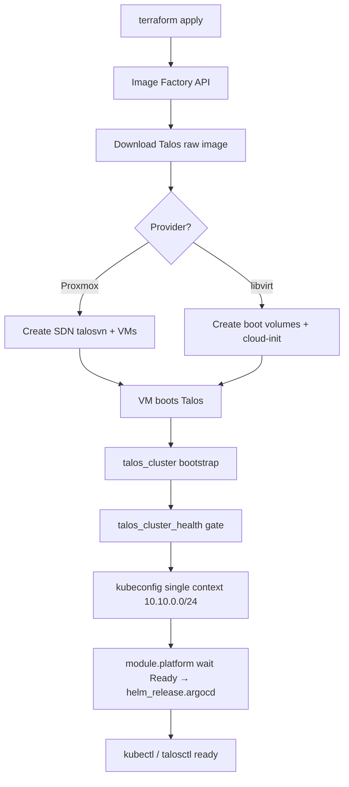

# infra-talos-homelab — Homelab GitOps with Talos Linux on Proxmox & Libvirt

> One `terraform apply` → HA Kubernetes, reproducible, immutable.

[](https://www.terraform.io/)
[](https://www.talos.dev/)
[](./LICENSE)
[](https://github.com/Seom88/infra-talos-homelab/actions/workflows/deploy.yaml)
[](https://github.com/Seom88/infra-talos-homelab/commits/main)
[](https://docs.renovatebot.com/)

[](https://github.com/Seom88/infra-talos-homelab/stargazers)

[](#roadmap--changelog)
[](#roadmap--changelog)


*Demo: cluster bootstrap ~8 min — 3 CP + workers (via `just tf-apply` on Proxmox prod).*

## 📑 Contents

- [Why This Exists](#why-this-exists)
- [Skills Demonstrated](#skills-demonstrated)
- [Highlights](#highlights)
- [Architecture](#architecture)
- [Quick Start](#quick-start)
- [Validation & Quality](#validation--quality)
- [Roadmap & Changelog](#roadmap--changelog)
- [Author](#author)
- [Related Projects](#related-projects)
- [License](#license)
- [Docs →](./docs/architecture.md) · [Networking](./docs/networking.md) · [Variables](./docs/variables.md) · [Operations](./docs/operations.md) · [Platform](./docs/platform.md) · [Usage](./docs/usage.md) · [CI/CD](./docs/ci-cd.md) · [ADRs](./docs/adr/)

## 🎯 Why This Exists

Learn IaC by operating a real cluster, not mocking one. This repo provisions a [Talos Linux](./docs/decisions.md#1-talos-linux-vs-kubeadm) HA Kubernetes substrate on [Proxmox VE](./docs/decisions.md#2-proxmox-ve-vs-esxi-bare-metal) (prod) and [libvirt](./docs/decisions.md#3-libvirt-kvm-vs-proxmox-only) (local dev) from a single provider-agnostic Terraform module (Terraform vs Ansible/Pulumi rationale lives under [Proxmox](./docs/decisions.md#2-proxmox-ve-vs-esxi-bare-metal)/[libvirt](./docs/decisions.md#3-libvirt-kvm-vs-proxmox-only)) — immutable OS, declarative machine configs, reproducible rebuilds in minutes.

Infrastructure alone isn't enough: without a distributed storage layer, Kubernetes can't run stateful workloads at scale. That's the gap the companion repo fills.

**This repo (infra):** builds the substrate — VMs, Talos bootstrap, [Proxmox SDN/NAT networking](./docs/decisions.md#2-proxmox-ve-vs-esxi-bare-metal) ([libvirt mirror](./docs/decisions.md#3-libvirt-kvm-vs-proxmox-only)), [Tailscale subnet routing](./docs/decisions.md#4-tailscale-subnet-routing-vs-per-node-extension), kubeconfig, and [ArgoCD](./docs/decisions.md#6-argocd-vs-fluxcd) as the GitOps engine — in one `terraform apply` with remote S3 state, health gates, and rolling upgrades.

**Companion repo ([secured-gitops-tailscale-homelab](https://github.com/Seom88/secured-gitops-tailscale-homelab)):** declares everything that *runs* on it — [Longhorn](./docs/decisions.md#5-longhorn-vs-ceph-rook) (wave-0, CSI-gated so PVCs bind before Vault), cert-manager, Vault (HA Raft), SeaweedFS, monitoring (kube-prometheus-stack + Loki), and Tailscale ingress — via App-of-Apps sync-waves. See its [`platform/`](https://github.com/Seom88/secured-gitops-tailscale-homelab/tree/main/platform) and [`gitops/templates/apps/`](https://github.com/Seom88/secured-gitops-tailscale-homelab/tree/main/gitops/templates/apps) (`00-longhorn` → `01-vault` → `02-seaweedfs` → `03-monitoring` → `04-tailscale`).

**[Cilium is the exception that stays here.](./docs/decisions.md#7-cilium-inlinemanifest-vs-helm-application)** CNI must be patched at Talos machine-config before the first node boots (Sidero: `KubeFlannelCNIConfig $patch: delete` + InlineManifest, KubePrism `localhost:7445`). It can't be an ArgoCD Application (ArgoCD needs networking to become Healthy — circular dependency (CNI must exist before ArgoCD can become Healthy — chicken-and-egg)). Future work tracks it in [Roadmap](#roadmap--changelog).

> Why these choices? See the [Decision Log](./docs/decisions.md) for the `why X over Y` trade-offs ([Talos vs kubeadm](./docs/decisions.md#1-talos-linux-vs-kubeadm), [Proxmox vs ESXi](./docs/decisions.md#2-proxmox-ve-vs-esxi-bare-metal), [libvirt vs Proxmox-only](./docs/decisions.md#3-libvirt-kvm-vs-proxmox-only), [Tailscale subnet vs extension/WireGuard](./docs/decisions.md#4-tailscale-subnet-routing-vs-per-node-extension), [Longhorn vs Ceph/Rook](./docs/decisions.md#5-longhorn-vs-ceph-rook), [ArgoCD vs FluxCD](./docs/decisions.md#6-argocd-vs-fluxcd), [Cilium InlineManifest vs Helm](./docs/decisions.md#7-cilium-inlinemanifest-vs-helm-application)). Full MADRs live in [`docs/adr/`](./docs/adr/).

## 🧠 Skills Demonstrated

| Area | What this proves | Evidence |
|------|------------------|----------|
| Terraform & IaC | Modular, DRY, multi-env (4 envs), 57 validations, S3 remote state · [Proxmox](./docs/decisions.md#2-proxmox-ve-vs-esxi-bare-metal) / [libvirt](./docs/decisions.md#3-libvirt-kvm-vs-proxmox-only) | [`environments/`](./environments/proxmox/prod/), [`modules/`](./modules/talos-cluster/), [`docs/variables.md`](./docs/variables.md) |
| Kubernetes & Talos | Immutable [Talos Linux](./docs/decisions.md#1-talos-linux-vs-kubeadm) HA CP, rolling upgrades via `talos_machine.image` | [`modules/talos-cluster/`](./modules/talos-cluster/), [`docs/operations.md`](./docs/operations.md) |
| Networking | [Proxmox](./docs/decisions.md#2-proxmox-ve-vs-esxi-bare-metal) SDN `talosvn` SNAT + [libvirt](./docs/decisions.md#3-libvirt-kvm-vs-proxmox-only) NAT `virbr-talos` + [Tailscale subnet routing](./docs/decisions.md#4-tailscale-subnet-routing-vs-per-node-extension) `10.10.0.0/24` | [`docs/networking.md`](./docs/networking.md), [`docs/adr/001-remove-tailscale-extension.md`](./docs/adr/001-remove-tailscale-extension.md) |
| GitOps & Platform | Composable [ArgoCD](./docs/decisions.md#6-argocd-vs-fluxcd) (`helm_release`), [Longhorn](./docs/decisions.md#5-longhorn-vs-ceph-rook) CSI gate, App-of-Apps waves | [`modules/platform/`](./modules/platform/), [`docs/platform.md`](./docs/platform.md) |
| CI/CD & Quality | `tf-validate` matrix (4 envs), `tf-fmt`, Renovate weekly, Tailscale in CI | [`.github/workflows/deploy.yaml`](./.github/workflows/deploy.yaml), [`docs/ci-cd.md`](./docs/ci-cd.md) |
| Operations | Destroy-safe `tfvars` map (🔴🟡🟢), `pve-sdn-ensure.service` reboot fix · [Longhorn HA](./docs/decisions.md#5-longhorn-vs-ceph-rook) | [`docs/operations.md`](./docs/operations.md), [`docs/adr/003-sdn-snat-runtime-drift.md`](./docs/adr/003-sdn-snat-runtime-drift.md) |
| Security & Hardening | Least-privilege Proxmox token, S3 `skip_*`, no per-node Tailscale keys · [Tailscale](./docs/decisions.md#4-tailscale-subnet-routing-vs-per-node-extension) | [`docs/networking.md`](./docs/networking.md), [`docs/ci-cd.md`](./docs/ci-cd.md) |

## ✨ Highlights

- 🏗️ **Two providers, one module** — Proxmox (`bpg/proxmox`) + libvirt (`dmacvicar/libvirt`) share `modules/talos-cluster` → [Architecture](./docs/architecture.md)
- 🔒 **Hardened & reproducible** — 57 validation blocks, pinned providers, one `terraform apply` for infra + ArgoCD → [Variables](./docs/variables.md) · [CI/CD](./docs/ci-cd.md)
- 🌐 **SDN/NAT + subnet routing** — `talosvn` SNAT + `virbr-talos` NAT, Tailscale `10.10.0.0/24` without node extension (ADR 001) → [Networking](./docs/networking.md)
- ♻️ **In-place upgrades** — bump `talos_version` → sequential `talos_machine.image` rolling reboot (`-parallelism=1`, `drain_on_upgrade=false`) → [Operations](./docs/operations.md)
- 📦 **Longhorn-ready, GitOps-native** — kubelet extraMounts + `iscsi-tools` extensions, Longhorn as wave-0 ArgoCD app → [Platform](./docs/platform.md)
- ⚡ **Fast & safe** — bootstrap ~8 min (`-parallelism=10`), upgrades safe (`-parallelism=1`), 60s dry-run `just tf-validate` → [Usage](./docs/usage.md)

## 🏗️ Architecture

Two paths, same bootstrap. Minimal diagram — full ascii trees, repo layout, and bootstrap explanation in [docs/architecture.md](./docs/architecture.md).


```mermaid
flowchart TD
    A[terraform apply] --> B[Image Factory API]
    B --> C[Download Talos raw image]
    C --> D{Provider?}
    D -->|Proxmox| E[Create SDN talosvn + VMs]
    D -->|libvirt| F[Create boot volumes + cloud-init]
    E --> G[VM boots Talos]
    F --> G
    G --> H[talos_cluster bootstrap]
    H --> I[talos_cluster_health gate]
    I --> J[kubeconfig single context 10.10.0.0/24]
    J --> K[module.platform wait Ready → helm_release.argocd]
    K --> L[kubectl / talosctl ready]
```

> **Proxmox:** `proxmox_sdn_zone` + VNet `talosvn` + subnet `snat=true` + `proxmox_sdn_applier` → VMs → `talos_cluster_health` (direct per-node IPs, 10 m) → kubeconfig via subnet route → ArgoCD.
> **Libvirt:** `virbr-talos` NAT + DHCP + pool `talos-pool` + cached nocloud image → same bootstrap. Both share `modules/talos-cluster`.
> Full detail → [docs/architecture.md](./docs/architecture.md) · Networking → [docs/networking.md](./docs/networking.md) · Variables → [docs/variables.md](./docs/variables.md)

## 🚀 Quick Start

Prereqs: Terraform >= 1.11 + Proxmox VE 9.x *or* libvirt + KVM. For `prod` Proxmox, ensure `10.10.0.0/24` is reachable via Tailscale subnet router — see [Networking](./docs/networking.md).

```bash
# Libvirt — dev (default)
just tf-apply
just setup-cli                         # merge talosconfig + kubeconfig into ~/.talos/config, ~/.kube/config

# Proxmox — prod (S3 state)
just provider=proxmox env=prod tf-apply
just provider=proxmox env=prod setup-cli

# Libvirt — prod (S3 state)
just provider=libvirt env=prod tf-apply
just provider=libvirt env=prod setup-cli

# Proxmox — dev (local state)
just provider=proxmox env=dev tf-apply
just provider=proxmox env=dev setup-cli

# Libvirt — dev (local state)
just provider=libvirt env=dev tf-apply
just provider=libvirt env=dev setup-cli
```

**Verify:**

```bash
talosctl --talosconfig secrets/proxmox/prod/talosconfig.yaml -n 10.10.0.11 version
kubectl --kubeconfig secrets/proxmox/prod/kubeconfig.yaml get nodes
just status   # version + extensions + members for active provider/env
```

**60s dry-run (no creds, like CI validate):**

```bash
just tf-validate          # init -backend=false + validate on all 4 envs + platform
# or: just tf-ci          # + fmt check
```

Upgrades & destroy: `just tf-apply-upgrade` (`-parallelism=1`, protects etcd quorum) and `just tf-destroy` — see [Usage](./docs/usage.md) and [Operations](./docs/operations.md). All `just` tasks → [docs/usage.md](./docs/usage.md); variables → [docs/variables.md](./docs/variables.md).

## ✅ Validation & Quality

- **57 validation blocks** — semver (`talos_version`/`kubernetes_version`/`argocd_version`), CIDR, IP, `^(dev|prod)$`, nullable guards — across `modules/` + 4 envs.
- **CI matrix** — `terraform validate` on 4 envs (`init -backend=false`, no creds) + `terraform fmt -check` gate.
- **Local parity** — `just tf-validate` and `just tf-ci` mirror CI; `just tf-fmt` enforces formatting.
- **Renovate weekly** (Mon 05:00 `Europe/Madrid`) — Terraform providers grouped, `talos_version`/`argocd_version` via custom regex, `siderolabs/talos` pinned to `0.12.0-beta.0` per [ADR 002](./docs/adr/002-pinned-talos-provider-alpha.md), manual-review labels.

| Check | Env | Command | Link |
|-------|-----|---------|------|
| fmt | all | `terraform fmt -check -diff -recursive` | [`deploy.yaml`](./.github/workflows/deploy.yaml) |
| validate | `proxmox/prod` + `proxmox/dev` + `libvirt/prod` + `libvirt/dev` | `init -backend=false` + `validate` | [`docs/ci-cd.md`](./docs/ci-cd.md) |
| platform | `modules/platform` | `fmt` + `validate` (gated to `proxmox/prod`) | [`docs/platform.md`](./docs/platform.md) |

Details: [docs/ci-cd.md](./docs/ci-cd.md) · [docs/variables.md](./docs/variables.md) · `justfile` `tf-validate` / `tf-ci`.

## 🗺️ Roadmap & Changelog

**Status:** `Active` · Last deploy: Aug 2026 · See [CHANGELOG.md](./CHANGELOG.md) for full history (`[Unreleased]` + `2.0.0` composed platform, S3 state, SDN drift fix) and [CONTRIBUTING.md](./CONTRIBUTING.md) for conventions.

| Version | Highlights | Link |
|---------|------------|------|
| `[Unreleased]` | Deterministic App-of-Apps sync-wave Lua, SDN SNAT reboot fix (`pve-sdn-ensure.service`), [Longhorn](./docs/decisions.md#5-longhorn-vs-ceph-rook) dual-disk HA | [CHANGELOG#unreleased](./CHANGELOG.md#unreleased) |
| `2.0.0` | Composed platform (single state), S3 backend (RustFS), `talos_machine` rolling upgrades, 57 validations | [CHANGELOG#2.0.0](./CHANGELOG.md#200---2026-08-28) |

**Next (infra scope only):**

- **Cilium CNI via Talos InlineManifest** (replace kube-router, add Hubble & NetworkPolicies) — infra, not GitOps: Sidero requires `cluster.network.cni.name: none` (`KubeFlannelCNIConfig $patch: delete`) + `cluster.inlineManifests` before bootstrap and KubePrism on `localhost:7445`; ArgoCD needs CNI to become Healthy (chicken-and-egg). See [Decisions: Cilium InlineManifest vs Helm](./docs/decisions.md#7-cilium-inlinemanifest-vs-helm-application) → [Roadmap detail in Decisions](./docs/decisions.md#7-cilium-inlinemanifest-vs-helm-application).
- **Multi-node Proxmox SDN** (remove single-node `pve-sdn-ensure` limitation — see [ADR 003](./docs/adr/003-sdn-snat-runtime-drift.md) and [Decisions: Proxmox SDN](./docs/decisions.md#2-proxmox-ve-vs-esxi-bare-metal))
- **Talos/Kubernetes version stream validation** ([libvirt/dev → prod promotion](./docs/decisions.md#3-libvirt-kvm-vs-proxmox-only)) — cheap validation in ephemeral [libvirt](./docs/decisions.md#3-libvirt-kvm-vs-proxmox-only) before rolling prod.

> Platform workloads (Longhorn, Vault, monitoring, SeaweedFS, Tailscale ingress) are versioned and deployed from [secured-gitops-tailscale-homelab](https://github.com/Seom88/secured-gitops-tailscale-homelab) — see [its Roadmap](https://github.com/Seom88/secured-gitops-tailscale-homelab#roadmap). This repo only provides the substrate + ArgoCD.

## 👤 Author

**Seom** — Platform / SRE · Homelab GitOps & immutable infra enthusiast.

- LinkedIn: [linkedin.com/in/seom88](https://www.linkedin.com/in/seom88)
- GitHub: [github.com/Seom88](https://github.com/Seom88)
- Based in EU — remote · Open to Platform, SRE, DevOps roles (Terraform, Kubernetes, Talos, GitOps, Proxmox, networking)

If this helped you, a ⭐ on [Seom88/infra-talos-homelab](https://github.com/Seom88/infra-talos-homelab) keeps it alive — and feel free to reach out on LinkedIn.

## 📚 Related Projects

| Repo | Role |
|------|------|
| [`infra-talos-homelab`](https://github.com/Seom88/infra-talos-homelab) *(this repo)* | Cluster provisioning — Terraform + Talos, machine config patches, system extensions |
| [`secured-gitops-tailscale-homelab`](https://github.com/Seom88/secured-gitops-tailscale-homelab) | GitOps layer — ArgoCD, Vault, Tailscale, storage, platform apps |

## 📄 License

MIT — see [LICENSE](./LICENSE). Contributions welcome — see [CONTRIBUTING.md](./CONTRIBUTING.md).

---

*Deep dive:* [docs/architecture.md](./docs/architecture.md) · [docs/networking.md](./docs/networking.md) · [docs/variables.md](./docs/variables.md) · [docs/operations.md](./docs/operations.md) · [docs/platform.md](./docs/platform.md) · [docs/usage.md](./docs/usage.md) · [docs/ci-cd.md](./docs/ci-cd.md) · [ADRs](./docs/adr/) · [CHANGELOG](./CHANGELOG.md) · [CONTRIBUTING](./CONTRIBUTING.md)
