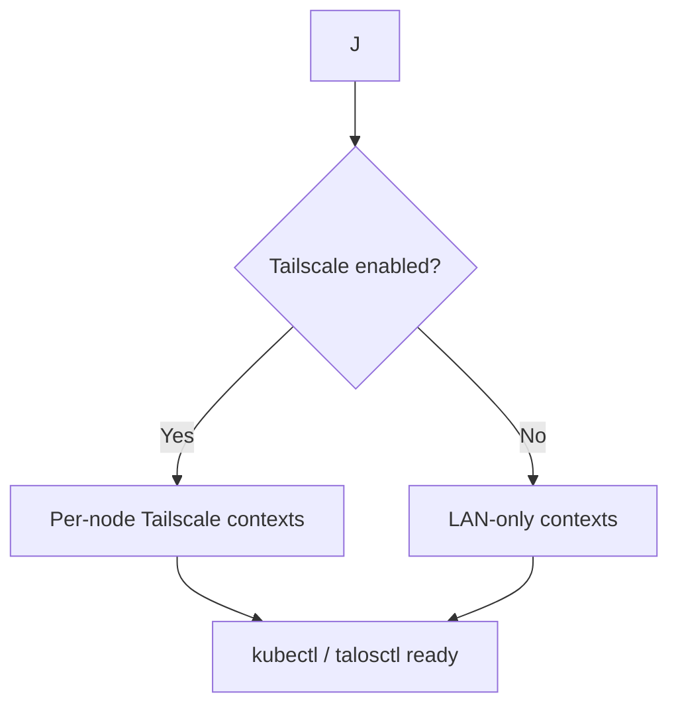

# 1. Remove Tailscale Talos extension, keep subnet routing

* **Status:** Accepted
* **Date:** 2026-08-27
* **Deciders:** infra-talos-homelab maintainers
* **Tags:** talos, tailscale, schematic, security, networking

## Context

`schematic-prod.yaml` included `siderolabs/tailscale` as a Talos system extension:

```yaml
customization:
  systemExtensions:
    officialExtensions:
      - siderolabs/iscsi-tools
      - siderolabs/qemu-guest-agent
      - siderolabs/tailscale
      - siderolabs/util-linux-tools
```

Each node injected an `ExtensionServiceConfig` via `modules/talos-cluster/main.tf`:

```hcl
var.tailscale_auth_key != "" ? yamlencode({
  apiVersion = "v1alpha1"
  kind       = "ExtensionServiceConfig"
  name       = "tailscale"
  environment = [
    "TS_AUTHKEY=${var.tailscale_auth_key}",
    "TS_ACCEPT_DNS=true"  # control plane / false on workers
  ]
}) : ""
```

And `variables.tf` / `outputs.tf` exposed `tailscale_auth_key` (7 files) and `kubeconfig_tailscale` (7 outputs) with per-node Tailscale hostnames (`${var.cluster_name}-${i}` → `https://${host}:6443`).

Two operational problems emerged:

1.  **Version coupling — CVE window.** The Tailscale binary version is pinned to the Talos release. When Tailscale 1.98.2 shipped CVEs that recommended an urgent update, Talos had not released a new version bundling it. The cluster was stuck on the vulnerable Tailscale until SideroLabs cut a new Talos release — an unacceptable supply-chain lag for a homelab that treats Tailscale as a security boundary.

2.  **Ghost devices on destroy.** `terraform destroy` left ephemeral Tailscale devices orphaned in the admin console (one per VM). This required a dedicated `scripts/destroy-tailscale-devices.sh` that called the Tailscale API (`devices:core:write`, `auth_keys:write` via `TS_OAUTH_CLIENT_ID` / `TS_OAUTH_SECRET`) before tearing down VMs. Commits `e431723`, `3db09b2`, `a63eeaf` introduced and hardened that script; CI `destroy.yaml` and `just tf-destroy` invoked it. The workaround added complexity and still required a reusable auth key.

Meanwhile, prod already had a **subnet router** alternative in place: the Proxmox host itself runs `tailscale set --advertise-routes=10.10.0.0/24` (SDN VNet `talosvn` with SNAT), approved in the Tailscale admin console, and CI uses `tailscale/github-action` for reachability. That path reaches the L2 VIP (`10.10.0.0/24`) without any per-node extension.

References — last commits with Tailscale enabled:

*   `git log --all --oneline --grep=tailscale --grep=Tailscale | head -5`:
    ```
    f720c57 feat: remove tailscale_domain variable and update related configurations
    a63eeaf feat: update CHANGELOG for version 1.0.2; add Tailscale cleanup script
    3db09b2 Fix: Tailscale device cleanup script
    e431723 feat: add Tailscale cleanup before destroy
    e9db14d Enhance infra docs — enabling Tailscale DNS
    ```
*   `git log --all --oneline -- schematic-prod.yaml | head -5`:
    ```
    d2aae06 feat: update README and CHANGELOG — disable siderolabs/tailscale (subnets easier, old Tailscale version)
    4710f8a Update Proxmox and Talos configurations: add schematic files (tailcale ENABLED)
    ```
*   **Last commit with `siderolabs/tailscale` active:** `4710f8a` (`schematic-prod.yaml` with `- siderolabs/tailscale` uncommented). Commit `d2aae06` commented it out with `# Disable because subnets is easier...`. If `4710f8a` is not reachable in your clone, use placeholder `<commit-hash-with-tailscale>` and `git show <hash>:schematic-prod.yaml` to recover.

## Decision

Remove the **Talos system extension** path, keep **Tailscale as subnet routing only**:

*   **Commented (not deleted)** `variable "tailscale_auth_key"` in 7 files with header:
    ```
    # Tailscale extension disabled - see docs/adr/001-remove-tailscale-extension.md
    # To enable: uncomment this variable AND uncomment siderolabs/tailscale in schematic-*.yaml
    ```
    Files: `modules/talos-cluster/variables.tf:72-78`, `modules/proxmox/variables.tf:149-154`, `modules/libvirt/variables.tf:167-172`, `environments/proxmox/dev/variables.tf:109-113`, `environments/proxmox/prod/variables.tf:109-113`, `environments/libvirt/dev/variables.tf:85-89`, `environments/libvirt/prod/variables.tf:85-89`.

*   **Commented** `ExtensionServiceConfig` ternaries in `modules/talos-cluster/main.tf:92-100` (control plane, `TS_ACCEPT_DNS=true`) and `:155-163` (worker, `TS_ACCEPT_DNS=false`) with `# Tailscale ExtensionServiceConfig disabled - uncomment together with variable and schematic`.

*   **Commented** pass-through assignments:
    `modules/proxmox/main.tf:197` (`tailscale_auth_key = var.tailscale_auth_key`), `modules/libvirt/cluster.tf:52`, `environments/proxmox/dev/main.tf:20`, `environments/proxmox/prod/main.tf:20`, `environments/libvirt/dev/main.tf:23`, `environments/libvirt/prod/main.tf:23` with `# tailscale disabled`.

*   **Deleted** `output "kubeconfig_tailscale"` blocks (7 files): `environments/proxmox/dev/outputs.tf`, `environments/proxmox/prod/outputs.tf`, `environments/libvirt/dev/outputs.tf`, `environments/libvirt/prod/outputs.tf`, `modules/proxmox/outputs.tf`, `modules/libvirt/outputs.tf`, `modules/talos-cluster/outputs.tf` (the `yamlencode` per-node `clusters/contexts/users` block 13-48).

*   **Schematic:** `schematic-prod.yaml` already had `# - siderolabs/tailscale` disabled; added explicit restore hint above it:
    ```
    # To re-enable Tailscale on nodes: uncomment below AND uncomment tailscale_auth_key in variables.tf / main.tf - see ADR
    ```

*   **Networking retained:** `tailscale set --advertise-routes=10.10.0.0/24` on the Proxmox host + `tailscale/github-action` in CI. No per-node `TS_AUTHKEY`, no `ExtensionServiceConfig`, no MagicDNS per-node contexts.

*   `TF_VAR_tailscale_auth_key` is now inert (commented variable). `terraform fmt -check -recursive` remains valid because `#` lines are HCL comments.

## Consequences

### Positive

*   Decouples Tailscale version from Talos releases — host Tailscale can be updated independently; CVE response no longer blocked.
*   Eliminates ghost-device cleanup (`scripts/destroy-tailscale-devices.sh` removed / no longer invoked; `just tf-destroy` no longer needs Tailscale API credentials).
*   Smaller schematic, faster image pull, reduced attack surface (one fewer system extension per node).
*   Canonical kubeconfig is the L2 VIP (`10.10.0.0/24` via `10.10.0.x:6443`); subnet routing keeps single DNS path, no split per-node contexts.

### Negative / Breaking

*   **Breaking for consumers of `kubeconfig_tailscale`:** any `terraform output kubeconfig_tailscale`, `module.*.kubeconfig_tailscale`, or scripts parsing per-node contexts (`kubectl config use-context talos-cp1` via Tailscale hostname) will fail. Migration: use `kubeconfig` (VIP) over the subnet route.
*   `TF_VAR_tailscale_auth_key` / `var.tailscale_auth_key` silently does nothing while commented — no error, but also no effect. Documented here to avoid confusion.
*   MagicDNS per-node reachability (`talos-cp1.tail-scale.ts.net:6443`) is gone. If the subnet router is down, there is no fallback path until the router is restored.

## Alternatives Considered

1.  **Keep extension, add version override:** Talos extensions do not allow overriding the bundled Tailscale version without forking the schematic — rejected.
2.  **Keep extension + keep subnet router (dual path):** Gives fallback but doubles device count and keeps the CVE coupling — rejected.
3.  **Move Tailscale to a DaemonSet / sidecar:** Possible but Talos is immutable; extension is the idiomatic way. Subnet router achieves the same reachability without in-node state — chosen.

## Restore Guide — Re-enable Tailscale extension

> Use this when you need per-node MagicDNS again (e.g., subnet router unavailable or you want direct tailnet IPs).

1.  **Uncomment the variable** in 7 files:
    *   `modules/talos-cluster/variables.tf` — `variable "tailscale_auth_key"`
    *   `modules/proxmox/variables.tf`
    *   `modules/libvirt/variables.tf`
    *   `environments/proxmox/dev/variables.tf`
    *   `environments/proxmox/prod/variables.tf`
    *   `environments/libvirt/dev/variables.tf`
    *   `environments/libvirt/prod/variables.tf`

2.  **Uncomment `ExtensionServiceConfig`** in `modules/talos-cluster/main.tf`:
    *   Lines `92-100` (control plane, `TS_ACCEPT_DNS=true`)
    *   Lines `155-163` (worker, `TS_ACCEPT_DNS=false`)
    *   Remove the leading `#` from the entire ternary block and keep the original header removed.

3.  **Restore schematic:**
    ```yaml
    # schematic-prod.yaml and schematic-dev.yaml
    customization:
      systemExtensions:
        officialExtensions:
          - siderolabs/iscsi-tools
          - siderolabs/qemu-guest-agent
          - siderolabs/tailscale   # ← uncomment
          - siderolabs/util-linux-tools
    ```

4.  **Regenerate schematic ID:**
    ```bash
    just get-schematic-id name="prod"   # and name="dev" if you changed dev
    # or: talosctl image factory schematic -f schematic-prod.yaml
    ```

5.  **Export auth key (reusable):**
    ```bash
    export TF_VAR_tailscale_auth_key="tskey-auth-..."
    # Create in Tailscale admin console: Settings → Keys → Auth keys → Reusable, tagged
    ```

6.  **Uncomment pass-through assignments:**
    *   `modules/proxmox/main.tf:197` — `tailscale_auth_key = var.tailscale_auth_key`
    *   `modules/libvirt/cluster.tf:52`
    *   `environments/proxmox/dev/main.tf:20`, `prod/main.tf:20`, `libvirt/dev/main.tf:23`, `libvirt/prod/main.tf:23`

7.  **Restore outputs** (if you need per-node kubeconfigs):
    Restore `output "kubeconfig_tailscale"` in the 7 `outputs.tf` files from commit `4710f8a`:
    ```bash
    git show 4710f8a:modules/talos-cluster/outputs.tf
    git show 4710f8a:environments/proxmox/prod/outputs.tf
    ```

8.  **Apply:**
    ```bash
    just provider=proxmox env=prod tf-apply   # or libvirt
    # Verify per-node contexts:
    kubectl --kubeconfig secrets/proxmox/prod/kubeconfig.yaml config get-contexts
    ```

9.  **(Optional) Restore destroy cleanup:**
    ```bash
    git show a63eeaf:scripts/destroy-tailscale-devices.sh > scripts/destroy-tailscale-devices.sh
    # Re-wire justfile / .github/workflows/destroy.yaml to call it before destroy
    ```

## Archived README Tailscale Documentation

> **TODO (next PR):** README still references Tailscale; this ADR is the canonical archive. A follow-up PR will replace README tailscale sections with `> Tailscale extension removed — see [ADR-001](./001-remove-tailscale-extension.md)` and keep only the subnet-router reachability note. **README was intentionally NOT modified in this change to avoid a large breaking diff.**

Copied verbatim / summarized from `README.md` at the time of this ADR (commit `23f3ecb` + working tree):

### 1. Highlights

*   `- **Tailscale integration** — optional MagicDNS for multi-network access with per-node kubeconfig contexts`
*   `- **Custom Talos image** — Image Factory schematic bundles `iscsi-tools`, `qemu-guest-agent`, `tailscale`, `util-linux-tools` → now bundles without `tailscale`.

### 2. Architecture (Proxmox + Libvirt)

```
Proxmox VE
├── N × control plane nodes  (L2 VIP shared, Tailscale in prod)
└── M × worker nodes         (Tailscale in prod)
...
└── modules/talos-cluster/
    ├── Bootstrap
    └── Kubeconfig           (LAN + Tailscale contexts)
```

Libvirt similarly listed `Kubeconfig (LAN + Tailscale contexts)`.

### 3. Structure

*   `scripts/destroy-tailscale-devices.sh    # Pre-destroy Tailscale device cleanup`
*   `outputs.tf                   # talosconfig, kubeconfig, kubeconfig_tailscale`

### 4. How it works (mermaid)



Proxmox path note: *"…kubeconfig is generated with both LAN (VIP) and Tailscale contexts."* Same for libvirt.

### 5. Quick start (Proxmox + Libvirt)

```bash
# (Optional) enable Tailscale for prod
export TF_VAR_tailscale_auth_key="tskey-auth-..."

# Bootstrap
just tf-apply
just provider=proxmox env=dev tf-apply

# (Optional) enable Tailscale
export TF_VAR_tailscale_auth_key="tskey-auth-..."
just provider=libvirt tf-apply
```

Note: *Tailscale is only enabled for `prod`.*

### 6. Network reachability (Proxmox SDN) — RETAINED as subnet routing

> This section is **kept** (not archived) because it describes the subnet-router path that remains canonical:
>
> ```bash
> # 1. On the Proxmox host (subnet router — it already runs Tailscale)
> sudo tailscale set --advertise-routes=10.10.0.0/24
> ```
> 2. Approve the route: admin console → **Machines** → host row → **Subnets** → **Edit route settings** → tick `10.10.0.0/24`
> 3. On device running Terraform: `sudo tailscale set --accept-routes`

Without the route, `talos_cluster_health` times out (15 m).

### 7. Variables

| Variable | Providers | Description | Default |
|----------|-----------|-------------|---------|
| `tailscale_domain` | Proxmox/Libvirt | Tailscale MagicDNS domain | `tail-scale.ts.net` |
| `tailscale_auth_key` | Libvirt | Tailscale auth key (empty = skip) | `""` |
| `tailscale_auth_key` | both (shared) | Tailscale auth key (empty = skip) | `""` (opt-in) |
| `tailscale_auth_key` | module | pass-through to `talos-cluster` | `""` |

Proxmox table row: `tailscale_domain | Tailscale MagicDNS domain | tail-scale.ts.net`
Libvirt table rows: `tailscale_auth_key | Tailscale auth key (empty = skip) | ""` + `tailscale_domain`
Shared table: `tailscale_auth_key | both | Tailscale auth key (empty = skip) | "" (opt-in)`

Also: `cluster_vip`, `installer_image`, `cp_allow_scheduling` remain.

### 8. Safe / Destroying changes

*   Safe to change: `endpoint`, `api_token`, `ssh_username`, `ssh_node_address`, `insecure`, `tailscale_auth_key`, `tailscale_domain`, `nodes_cp[].allow_scheduling`.

### 9. Outputs

| Output | Providers | Description |
|--------|-----------|-------------|
| `talosconfig` | both | Talos client configuration for talosctl |
| `kubeconfig` | both | Standard kubeconfig for kubectl |
| `kubeconfig_tailscale` | both | Kubeconfig with one context per Tailscale hostname |
| `machine_configuration_cp` | module | Talos machine config for control plane nodes |
| `machine_configuration_worker` | module | Talos machine config for worker nodes |

### 10. Access

```bash
# LAN (L2 VIP)
talosctl --talosconfig secrets/proxmox/prod/talosconfig.yaml version

# Tailscale (per-node contexts, prod only)
kubectl --kubeconfig secrets/proxmox/prod/kubeconfig.yaml get nodes
kubectl --kubeconfig secrets/proxmox/prod/kubeconfig.yaml config use-context talos-cp1

# Tailscale (per-node contexts)
kubectl --kubeconfig secrets/libvirt/dev/kubeconfig.yaml get nodes
kubectl --kubeconfig secrets/libvirt/dev/kubeconfig.yaml config use-context talos-cp1
```

### 11. CI/CD

| Secret | Description |
|--------|-------------|
| `TS_OAUTH_CLIENT_ID` | Tailscale OAuth client ID |
| `TS_OAUTH_SECRET` | Tailscale OAuth client secret |
| `TAILSCALE_AUTH_KEY` | Tailscale auth key — **reusable** (see below) |

> **About `TAILSCALE_AUTH_KEY`**: Create it in Tailscale admin console under **Settings → Keys → Auth keys**. Enable **Reusable** (same key across workflow runs). On `terraform destroy`, the `scripts/destroy-tailscale-devices.sh` script cleans up devices via the Tailscale API before tearing down VMs — no manual cleanup needed.

GitHub comment: `// Terraform need access using ssh, use ssh from tailscale (https://tailscale.com/kb/1193/tailscale-ssh/)`
OAuth creation: `tag:terraform` with scopes `devices:core:write` + `auth_keys:write`.

---

## References

*   `schematic-prod.yaml:6-7` — `# Disable because subnets is easier...` + `# - siderolabs/tailscale`
*   `modules/talos-cluster/main.tf:92-100`, `155-163` — `ExtensionServiceConfig` ternaries (now commented)
*   `scripts/destroy-tailscale-devices.sh` — introduced in `e431723`, hardened in `3db09b2`, changelog in `a63eeaf`
*   `justfile` — `tf-destroy` cleaned up Tailscale devices first (now removed)
*   `.github/workflows/destroy.yaml` — tear down + Tailscale cleanup

## TODO

*   [ ] Next PR: replace README tailscale sections with short pointer to this ADR; keep only subnet-router reachability note.
*   [ ] Remove `justfile` / workflow `TS_OAUTH_*` / `TAILSCALE_AUTH_KEY` references once README is cleaned.
*   [ ] Verify `terraform fmt -check -recursive` and `terraform validate` pass on all 4 environments after commenting.
